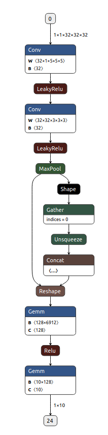

## Voxnet Architecture - Netron

## Tutorial Codes for 3D convolution
This is a tutorial code for studying the __3D CNN__
It aims to make beginners to acheive basic understanding on 3D Convolution.
I'm working on the code to make the application fully functional.
My goal is to profile 3D convolution in GPU and replace the kernel to Sparse Matrix Multiplication based Convolution.
_Since the 3D data is very sparse_, there can be some issues when the CNN task is offloaded to GPU.
The sparsity and irregular distribution of the 3D data can incur _poor utilization_ in GPU.
Also representing 3D world in dense matrix format cause memory pressure.
I expect implementing Sparse 3D CNN will greatly improve both performance and the scalabilty.

The base idea is referencing the [VoxNet](http://dimatura.net/publications/voxnet_maturana_scherer_iros15.pdf).

## Converting Dense Matrix to Sparse Matrix
To convert Dense matrix to Sparse matrix, sparse.cu provides gpu accelerated function.
2d Dense array -> coo(coordinate) -> csc/csr format


### Dependencies

### Examples
### Usage
```
// implementation without convolution parameter(padding, stride, groups, dilation)
__global__ void cube_to_coo(int input_d, int input_h, int input_w, float* input_data,
    int output_d, int output_h, int output_w, float* output_data,
    int *row, int* col,*int val, int nnz)
{
    // block[8] : 0 ~ 7
    int input_w_idx = (blockIdx.x % output_w) + threadIdx.x;
    int input_h_idx = (blockIdx.x / output_w) % output_h + threadIdx.y;
    int input_d_idx = ((blockIdx.x / output_w) / output_d) % output_d + threadIdx.z;

    int input_idx =  input_d_idx*(input_h*input_w)
        + intput_h_idx*(input_w)
        + input_w_idx;
    
    if(input_data[input_idx])
    {
        int global_idx = atomicAdd(&nnz, 1);
        row[global_idx] = threadIdx.z*(blockDim.y*blockDim.x)
            + threadIdx.y*blockDim.x
            + threadIdx.x;
        col[global_idx] = blockIdx.x;
    }
}
void test_cuda(Mat& input, Param& p)
{
    // coo format
    int *row_h;
    int *col_h;
    float *val_h;

    int *row_d;
    int *col_d;
    float *val_d;
    
    cudaMalloc((void**)&row_d,sizeof(int)*nnz);
    cudaMalloc((void**)&col_d,sizeof(int)*nnz);
    cudaMalloc((void**)&val_d,sizeof(float)*nnz);

    // 3D-input
    float* input_data_d;
    cudaMalloc((void**)&input_data_d, sizeof(float)*input.N*input.C*input.D*input.H*input.W);
    cudaMemcpy(input_data_d, input.data, sizeof(float)*input.N*input.C*input.D*input.H*input.W);

    int grid = output.D*output.H*output.W;
    int block_size = 128;   // about filter D, H, W   

    
}

```
